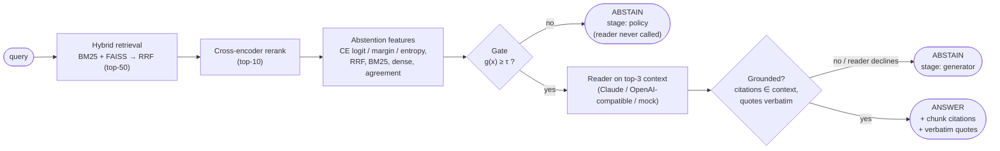
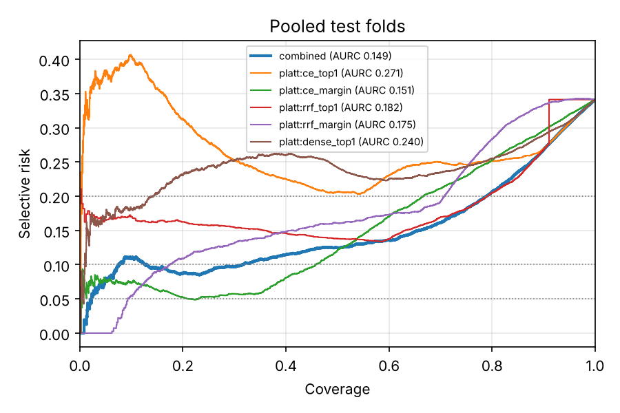
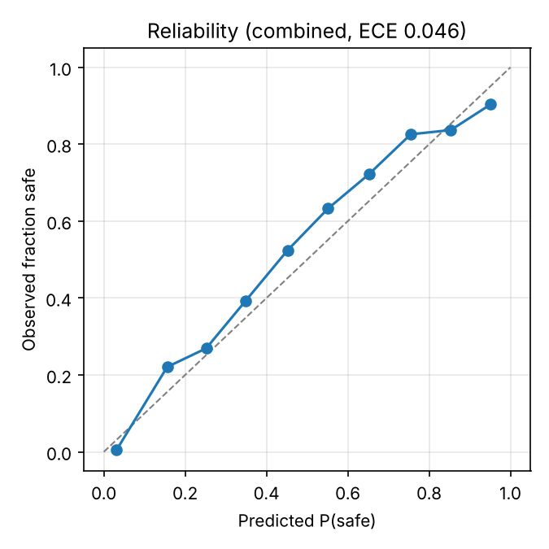

# Selective RAG with Calibrated Abstention


A retrieval-augmented QA system that **answers only when its evidence supports an answer**,
and otherwise abstains. The decision to answer is a calibrated threshold on a learned
confidence score. The threshold can be chosen with **Learn-then-Test (LTT)**, which gives a
finite-sample, distribution-free guarantee on the error rate among answered questions:
`P(selective risk ≤ α) ≥ 1 − δ`.

> **TL;DR (offline benchmark, α = 0.2).** Standard RAG answers every unanswerable question:
> hallucination rate **1.00**, selective risk 0.71. Putting a calibrated gate in front of the
> reader cuts hallucination to **0.05** and selective risk to **0.17**, with lower hallucination
> in 100% of the 200 evaluation splits. The empirical (ERM) threshold breaks its α target in
> 34–54% of splits. LTT holds its guarantee (violation rate **≤ 2%**, well under δ = 10%), but
> with 100 items it can rarely certify a useful threshold, and it says so.
>
> These numbers come from **offline stand-ins**: a hashing embedder, a lexical mock reranker and
> a mock extractive reader. Every component has a real backend (bge-small, an MS MARCO
> cross-encoder, Claude or an OpenAI-compatible LLM) that you can switch on with one flag; see
> [Reproducibility](#reproducibility).

---

## Contents
- [Motivation](#motivation)
- [Method](#method)
- [Components](#components)
- [Benchmark](#benchmark)
- [Findings and limitations](#findings-and-limitations)
- [Reproducibility](#reproducibility)
- [Interactive CLI](#interactive-cli)
- [Project layout](#project-layout)
- [Roadmap](#roadmap)
- [References](#references)

## Motivation

A standard RAG pipeline always produces an answer. When the corpus doesn't contain the answer,
or the retriever misses it, the generator still writes something fluent and wrong. Three easy
fixes fail in instructive ways:

1. **"Let the LLM say *I don't know*."** Self-abstention helps (hallucination 1.00 → 0.27 here),
   but the generator's own judgement is uncalibrated, and it still answers about a quarter of
   unanswerable questions.
2. **"Threshold a retrieval score."** A single signal ranks safe vs unsafe queries poorly
   (AUROC 0.69–0.84 across signals), and a threshold picked by eye has no meaning on new data.
3. **"Tune the threshold on held-out data (ERM)."** This is the most common practice. On our
   benchmark, the ERM threshold's **test** risk exceeds α in **34–54% of splits**, so the
   promised error rate is a coin flip.

This project treats abstention as **selective prediction with risk control**:
- learn a confidence `g(x)` from many pipeline signals;
- choose the threshold `τ` so that the error rate among answered questions is *provably* bounded;
- measure the coverage that guarantee costs, and report it honestly.

## Method

### Architecture: two-stage abstention



<details><summary>ASCII version</summary>

```
query ─► HybridRetriever (BM25 + FAISS, RRF, top-50) ─► CrossEncoder rerank (top-10)
      ─► 9 abstention features ─► g(x) ≥ τ ? ── no ──► ABSTAIN  (stage = policy, no LLM call)
                                              │
                                              yes
                                              ▼
                     Reader(top-3 context) ─► validate citations + verbatim quotes
                                              │
                         declines / invalid ──┴──► ABSTAIN  (stage = generator)
                                              │
                                              ▼
                                   ANSWER + citations + quotes
```
</details>

### Formulation

For a query `x`, let `y(x) = 1` if answering is *safe*: the question is answerable **and** the
pipeline's answer is correct (token-F1 ≥ 0.5 **and** every number and entity in the reference
appears in the answer). The policy answers iff `g(x) ≥ τ`.

| Quantity | Definition |
|---|---|
| Coverage | `φ(τ) = P(g(x) ≥ τ)` |
| Selective risk | `R(τ) = P(y = 0 \| g(x) ≥ τ)`: errors among answered questions |
| Goal | maximise `φ(τ)` subject to `R(τ) ≤ α` |

**Confidence model.** L2-regularised logistic regression (numpy, IRLS) on 9 features:
- cross-encoder top-1 logit, top-1 minus top-2 margin, and softmax entropy;
- RRF top-1 and margin;
- BM25 and dense top-1;
- BM25-vs-dense rank agreement;
- top-5 overlap between BM25 and dense.

Single signals are Platt-scaled baselines.

**Choosing τ on a calibration set.** Candidate thresholds are ordered from strict to permissive.
For each threshold λ_j, let `n_j` be the number of calibration items answered and `e_j` the
number of errors among them.
- **ERM:** take the largest coverage with `e_j / n_j ≤ α`. There is no guarantee.
- **Learn-then-Test** (Angelopoulos et al., 2021):
  - Test `H_j : R(λ_j) > α` with the exact binomial p-value `p_j = P(Bin(n_j, α) ≤ e_j)`.
  - Use **fixed-sequence testing** on a coverage grid fixed on the *train* split: reject while
    `p_j ≤ δ`, and stop at the first failure.
  - The result satisfies `P(R(τ̂) ≤ α) ≥ 1 − δ`.
  - **Price:** even with zero errors you need `n ≥ ⌈log δ / log(1 − α)⌉` answered calibration
    items. That's 11 at α = 0.2 and 22 at α = 0.1 (δ = 0.1). If they're not available, LTT
    abstains on everything and reports why.

**Protocol.**
- 200 stratified train / calibration / test splits (40/30/30).
- `g` is fitted on train, `τ` chosen on calibration, and everything is scored on test.
- Reader outputs are computed once per item and cached, so a real-LLM run costs about 200 calls.

## Components

| Phase | Module | What it does |
|---|---|---|
| 1 | [`src/data_loader.py`](src/data_loader.py) | arXiv downloader (idempotent, rate-limited), pypdf extraction, recursive 512/64 chunking with exact character offsets and page provenance |
| 1 | [`src/retriever.py`](src/retriever.py) | BM25 (overlap-filtered) + FAISS `IndexFlatIP` (bge-small) fused by Reciprocal Rank Fusion; per-retriever ranks kept as features |
| 2 | [`eval/synthetic_gen.py`](eval/synthetic_gen.py), [`eval/schemas.py`](eval/schemas.py) | 100-item ground truth: 70 answerable (50 factoid, 20 two-fact reasoning) + 30 unanswerable (out-of-domain, hallucinated entity, false premise). Strict Pydantic schemas. Deterministic offline engine and an LLM engine with an adversarial judge |
| 3 | [`src/reranker.py`](src/reranker.py) | Cross-encoder reranking (`cross-encoder/ms-marco-MiniLM-L6-v2`, raw logits) with a logged offline fallback |
| 4 | [`src/abstention.py`](src/abstention.py), [`eval/abstention_eval.py`](eval/abstention_eval.py) | Features, logistic calibrator, ERM / LTT thresholds, JSON-persisted `AbstentionPolicy`; AUROC / AURC / ECE / risk-coverage benchmark |
| 5 | [`src/generator.py`](src/generator.py), [`src/pipeline.py`](src/pipeline.py), [`eval/e2e_eval.py`](eval/e2e_eval.py) | Citation-grounded reader (validated citations and verbatim quotes, retry, abstention), end-to-end pipeline, standard vs selective RAG benchmark |
| 6 | [`src/cli.py`](src/cli.py) | Interactive CLI: scores, gate verdict, cited answer |

Every model-backed component has a deterministic offline stand-in. That keeps the whole system
testable without network access or model weights. A stand-in is only ever used through an
explicit, **logged** fallback, and it is recorded in every report. Each `--strict-*` flag
disables its fallback.

## Benchmark

**Eval set.** 100 items over a 144-chunk synthetic corpus of 16 papers. Every answer is linked to
the exact chunk(s) that state it. Dev-split and ablation numbers act as in-paper hard negatives.
The set is byte-reproducible from a seed (`data/eval/eval_set.json`).

All tables below were produced by the scripts in this repository on the committed eval set,
with **hashing embedder + mock reranker + mock extractive reader**. Brackets give the 5th–95th
percentile over 200 splits.

### 1. Retrieval (answerable items, n = 70)

| Retriever | Hit@1 | Hit@5 | MRR@10 | Recall@10 | Top-1 AUROC (answerable vs not) |
|---|---|---|---|---|---|
| Dense (FAISS) | 0.714 | **1.000** | 0.843 | **1.000** | 0.667 |
| Sparse (BM25) | **0.914** | 0.943 | **0.931** | 0.971 | 0.651 |
| Hybrid (RRF, k = 60) | 0.871 | 0.986 | 0.919 | **1.000** | **0.777** |
| Hybrid + cross-encoder (mock) | 0.871 | 0.943 | 0.909 | 0.957 | 0.689 |

The mock reranker doesn't help. All of its misses are vocabulary mismatch (e.g. *"backbone … based
on"* vs *"built on top of … encoder"*), which a lexical heuristic cannot bridge by construction.
Its weights were not tuned on the eval set to hide this.

### 2. Abstention signals (label: answerable and gold evidence in the top-3; 66/100 safe)

| Confidence model | AUROC ↑ | AURC ↓ | Brier ↓ | ECE (pooled) ↓ |
|---|---|---|---|---|
| **Combined (9 features)** | **0.854** [0.75, 0.95] | 0.146 | **0.135** | 0.046 |
| Platt: CE margin | 0.837 | **0.143** | 0.165 | **0.022** |
| Platt: RRF top-1 | 0.831 | 0.177 | 0.135 | 0.032 |
| Platt: dense top-1 | 0.728 | 0.202 | 0.199 | 0.094 |
| Platt: CE top-1 | 0.689 | 0.277 | 0.188 | 0.127 |

| α | Method | Test coverage | Test selective risk | **Violation rate** (LTT bounds it by δ = 0.1) |
|---|---|---|---|---|
| 0.1 | ERM | 0.435 | 0.106 | **53.5%** |
| 0.1 | LTT | 0.000 (needs ≥ 22 answered) | — | 0.0% |
| 0.2 | ERM | 0.740 | 0.178 | **34.0%** |
| 0.2 | LTT | 0.108 | 0.133 | **2.0%** |

<p align="center">
  
  
</p>

### 3. End to end: standard RAG vs selective RAG (α = 0.2, δ = 0.1)

| System | Coverage | Selective risk ↓ | Hallucination ↓ | Wrong-answer ↓ | Accuracy ↑ | EM | F1 | Key-fact | Violation |
|---|---|---|---|---|---|---|---|---|---|
| Standard RAG (always answers) | 1.000 | 0.711 | 1.000 | 0.587 | 0.289 | 0.126 | 0.458 | 0.503 | — |
| RAG + reader self-abstention | 0.635 | 0.564 | 0.269 | 0.396 | 0.496 | 0.160 | 0.523 | 0.597 | — |
| **Selective RAG (ERM gate)** | 0.283 | **0.173** | **0.049** | **0.064** | 0.509 | 0.341 | 0.701 | 0.887 | 41.0% |
| Selective RAG (ERM) + self-abstention | 0.302 | 0.187 | 0.048 | 0.075 | **0.521** | 0.320 | 0.686 | 0.877 | 42.5% |
| Selective RAG (LTT gate) | 0.000 | — | 0.000 | 0.000 | 0.300 | — | — | — | **0.0%** |

- *Hallucination* = share of **unanswerable** items that got an answer.
- *Accuracy* counts a correct abstention on an unanswerable item as correct.
- EM, F1 and key-fact are over answered answerable items.
- *Violation* = share of splits whose test risk exceeds α.

## Findings and limitations

- **Gating is what removes hallucination.** Reader self-abstention alone leaves 27% of
  unanswerable questions answered. The calibrated gate leaves 5%, and it skips the LLM call
  entirely for those queries.
- **ERM does not control risk.** Its test risk exceeds α in 34–54% of splits, across both the
  retrieval-level and end-to-end labels. Any production threshold tuned on a dev set has the
  same failure mode.
- **LTT controls risk, at a price that depends on data.** Its violation rate stays at 0–2%,
  well under δ, but certifying α needs ≥ ⌈log δ / log(1 − α)⌉ error-free answered calibration
  items. With 30 calibration items and a mock reader that is right on about 30% of questions,
  that is rarely possible, so LTT abstains and says why. **More calibration data, not a
  different method, is the fix.**
- **Offline stand-ins.** The mock reader can't do arithmetic: it gets 0/20 reasoning items right
  and 30/50 factoid items. The mock reranker can't bridge paraphrases. The absolute numbers
  are therefore a floor. The *relative* conclusions about ERM vs LTT and gating vs
  self-abstention are what the offline benchmark supports.
- **Synthetic data.** The ground truth comes from a fact table, which makes it exact, but
  real papers are messier. The arXiv ingestion pipeline and the LLM benchmark generator are
  implemented for that next step.

## Reproducibility

### Install
```bash
python -m venv .venv && source .venv/bin/activate
pip install torch --index-url https://download.pytorch.org/whl/cpu   # optional: CPU-only torch
pip install -r requirements.txt
```

### Offline: no network, no API keys, no model weights
```bash
python -m pytest -q                       # 320 passed, 3 skipped (opt-in integration tests)

# regenerate the eval set (byte-identical to the committed file)
python -m eval.synthetic_gen generate --offline --output data/eval/eval_set.json

# the three benchmarks (reports land in data/eval/*.md, figures in data/eval/figures/)
python -m eval.evaluate        run --baseline --embedder hashing --reranker mock
python -m eval.abstention_eval run --embedder hashing --reranker mock
python -m eval.e2e_eval        run --embedder hashing --reranker mock --generator mock
```
Every run is deterministic: reports are identical across `PYTHONHASHSEED` values.

### With real models
```bash
export ANTHROPIC_API_KEY=...          # or `ant auth login`; OpenAI-compatible: --generator openai --generator-model M [--base-url URL]

# real arXiv corpus
python -m src.data_loader download --query "retrieval augmented generation" --max-results 15
python -m src.data_loader ingest

# real embedder + cross-encoder + Claude reader; --strict-* turns every offline fallback into an error
python -m eval.e2e_eval run --embedder bge --reranker cross-encoder --strict-reranker \
                            --generator anthropic --strict-generator
RUN_INTEGRATION=1 python -m pytest -q   # also runs the live arXiv / model tests
```
The default reader model is `claude-opus-5-5`. An end-to-end run makes about 200 reader calls
(free and forced, per item). They are cached in `data/eval/generation_cache.jsonl`, so re-runs
are free.

## Interactive CLI

```bash
python -m src.cli ask "For how many epochs is SefiLens trained?" --embedder hashing
python -m src.cli chat                                      # :help, :k N, :gate on|off, :scores on|off, :json
python -m src.cli ask "..." --json                          # machine-readable
python -m src.cli ask "..." --calibrate ltt                 # guaranteed gate (may abstain on everything)
python -m src.cli ask "..." --policy policy.json            # saved AbstentionPolicy
python -m src.cli ask "..." --no-gate --forced-reader       # standard RAG, for comparison
```
Run the commands from the repository root (the default data paths are relative to it). After `pip install -e .`, the same commands are also available as `selective-rag ask …`.

```
Query: For how many epochs is SefiLens trained?
Backends: embedder hashing-256 · reranker mock-lexical-v1 · generator mock-extractive-v1 ⚠ offline stand-ins

① Retrieval + rerank (top-5)
   #  chunk                 rerank P(rel) 1st-stage BM25# dense# 1st#
   1  synth-0007::0004       -1.96   0.12    0.0328     1      1    1
   2  synth-0007::0007       -3.82   0.02    0.0315     3      4    4
   …
② Abstention gate  (ERM, α=0.2: empirical threshold, no statistical guarantee)
   g(x) = 0.939  ≥  τ = 0.822   → PASS
   strongest signals (z-score vs train; ↑ raises / ↓ lowers confidence): ce_margin z=+1.8 ↑, …

③ Answer
   "train SefiLens for 30 epochs"
   cited: synth-0007::0004  ❝We train SefiLens for 30 epochs.❞
```
Without `--policy`, the gate is calibrated at startup on the committed eval set (ERM, α = 0.2
by default). If you query a different corpus, the CLI warns that τ does not transfer.

## Project layout
```
src/            data_loader · retriever · reranker · abstention · llm · generator · pipeline · cli · server (stub)
eval/           schemas · synthetic_gen · evaluate · abstention_eval · e2e_eval
tests/          one test module per component (320 offline tests)
data/eval/      eval_set.json + synthetic_corpus.jsonl (committed); benchmark reports (generated)
docs/figures/   README figures (regenerate with eval.abstention_eval)
ROADMAP.md      phase-by-phase plan, results and future work
```

## Roadmap
Phases 0–6 are complete; see [ROADMAP.md](ROADMAP.md). Next steps:
- **Phase 7:** FastAPI service (`POST /query`), Docker image, CI.
- A larger LLM-generated eval set over the arXiv corpus, with paper-disjoint splits, so LTT can
  certify α ≤ 0.1.
- Conformal risk control (E[risk] ≤ α) as a less conservative alternative.
- NLI answer–evidence entailment and self-consistency as abstention features.
- An LLM judge for semantic answer equivalence.

## References
- Lewis et al. (2020). *Retrieval-Augmented Generation for Knowledge-Intensive NLP Tasks.* NeurIPS.
- Cormack, Clarke & Büttcher (2009). *Reciprocal Rank Fusion Outperforms Condorcet and Individual Rank Learning Methods.* SIGIR.
- Robertson & Zaragoza (2009). *The Probabilistic Relevance Framework: BM25 and Beyond.*
- Nogueira & Cho (2019). *Passage Re-ranking with BERT.*
- Geifman & El-Yaniv (2017). *Selective Classification for Deep Neural Networks.* NeurIPS.
- Angelopoulos, Bates, Candès, Jordan & Lei (2021). *Learn then Test: Calibrating Predictive Algorithms to Achieve Risk Control.*
- Angelopoulos & Bates (2021). *A Gentle Introduction to Conformal Prediction and Distribution-Free Uncertainty Quantification.*
- Kamath, Jia & Liang (2020). *Selective Question Answering under Domain Shift.* ACL.
- Rajpurkar et al. (2016). *SQuAD: 100,000+ Questions for Machine Comprehension of Text* (EM / F1).

## License
[MIT](LICENSE) © 2026 Shayan Salehi
